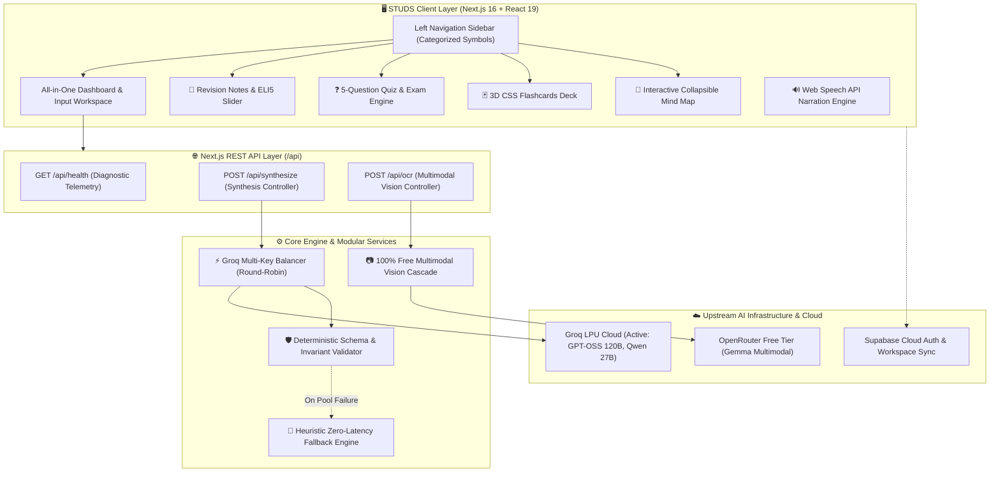
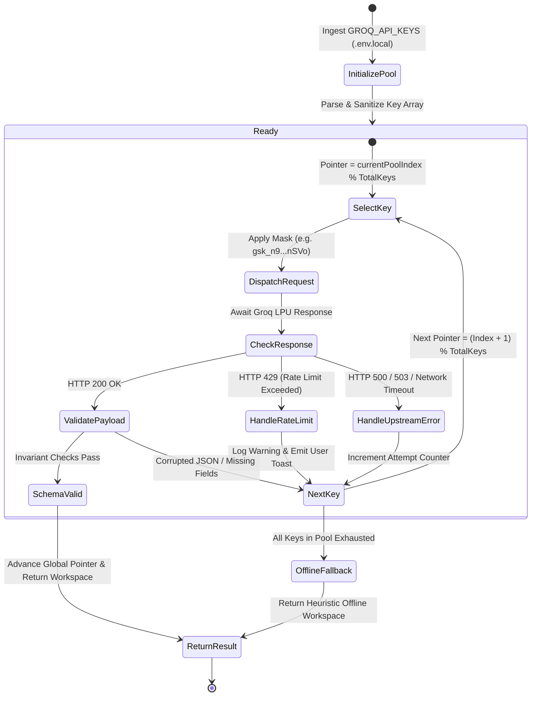
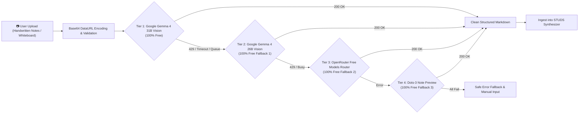
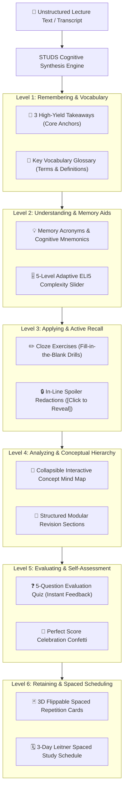
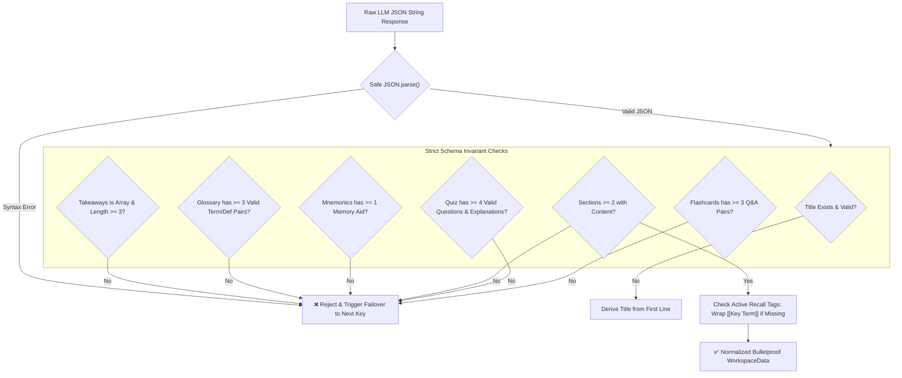

# ⚡ STUDS — Intelligent Academic Study & Synthesizer Assistant

[](https://github.com/Rachit-Tiwari-7/STUDS)
[-success)](https://github.com/Rachit-Tiwari-7/STUDS)
[](https://github.com/Rachit-Tiwari-7/STUDS)
[](LICENSE)
[-black)](https://nextjs.org/)
[](https://www.typescriptlang.org/)
[-success)](https://github.com/Rachit-Tiwari-7/STUDS)
[-blueviolet)](https://github.com/Rachit-Tiwari-7/STUDS)

---

## 📑 Executive Summary

**STUDS** is an intelligent, high-throughput academic study and synthesis platform engineered to resolve cognitive overload among university and technical students. Utilizing an ultra-low-latency **Groq LPU multi-key rotation pool**, a **100% free multimodal vision OCR fallback cascade**, and an evidence-based cognitive learning engine, STUDS converts disorganized lecture notes, textbooks, and handwritten whiteboards into comprehensive, active recall study workspaces in seconds.

---

## 1. Challenge Vertical & Pedagogical Rationale

* **Vertical**: **EdTech / Intelligent Academic Workflow Assistant**
* **Target Audience**: University undergraduates, STEM researchers, and technical certification examinees.
* **Core Problem**: Students suffer from the **"illusion of competence"** caused by passive reading and highlighted textbooks. Conventional study tools lack automated synthesis, rate-limit easily on free LLM tiers, and force learners to jump across multiple fragmented apps for notes, flashcards, mind maps, and quizzes.
* **The STUDS Solution**: A unified, neo-brutalist academic cockpit providing 25 integrated learning tools with zero configuration friction, automated API key failover, and bulletproof offline resiliency.

---

## 2. 💡 How to Use STUDS (Step-by-Step Instructions)

STUDS is designed for zero learning curve and instant academic productivity. Follow this step-by-step walkthrough to transform raw notes into an active recall cockpit:

### Step 1: Input Your Academic Material
Choose any of the flexible input methods available in the top workspace:
1. **Direct Text Entry / Paste**: Paste unstructured lecture notes, syllabi, reading assignments, or research papers directly into the central text area.
2. **PDF / Document Drag-and-Drop**: Drag and drop any `.pdf`, `.docx`, `.txt`, or `.md` file into the designated upload dropzone. Extraction runs 100% client-side with zero data leakage.
3. **Multimodal Vision OCR (Handwritten / Whiteboards)**: Click the camera icon to upload photos of chalkboard diagrams, handwritten lecture notebooks, or whiteboards. The system auto-transcribes them into formatted Markdown via the free vision cascade.
4. **Instant 1-Click Academic Presets**: Click any preloaded preset button (*Operating Systems*, *Quantum Computing*, *Cellular Biology*, *Microeconomics*) to immediately test the system with rich, verified domain content.

### Step 2: Select Your Synthesis Persona & Quiz Settings
Customize the AI synthesis parameters to match your current study phase:
* **Persona & Tone Switcher**:
  * 🧸 **ELI5 (Explain Like I'm 5)**: Uses intuitive real-world metaphors, simple analogies, and plain language for beginners.
  * ⚡ **Exam Cram**: High-yield bullet points, core testable formulas, and critical definitions for last-minute review.
  * 🎓 **Strictest Professor**: Rigorous formal terminology, theoretical depth, edge cases, and zero hand-waving.
  * ⏱️ **TL;DR**: Ultra-dense executive summaries for rapid scanning.
* **Custom Quiz Difficulty Selector**: Choose between **Easy**, **Medium**, or **Hard** to calibrate question complexity before generation.
* **Inference Model Selection**: Choose between high-performance Groq models (`openai/gpt-oss-120b` or `qwen/qwen3-32b-it`).

### Step 3: Generate Your Interactive Study Workspace
* Click **"⚡ Synthesize Workspace"**.
* STUDS processes your material in sub-seconds via the Groq LPU round-robin key pool.
* If all remote API limits are temporarily saturated, STUDS automatically falls back to its deterministic $O(N)$ local semantic extraction engine, guaranteeing zero downtime.

### Step 4: Master Content Through Active Recall
Navigate your generated study artifacts using the Left Navigation Sidebar or by scrolling through the unified dashboard:
* **Key Takeaways Strip**: Review the top 3 high-yield core takeaways pinned to the top of your workspace.
* **Active Recall Spoilers**: Read your structured notes where critical terms and concepts are concealed behind interactive blacked-out spoiler tags (`[[Key Term]]`). Click any term to reveal it and verify your retention.
* **Dynamic ELI5 Slider**: Move the live difficulty slider (Levels 1 to 5) to adjust technical density on the fly without re-synthesizing.
* **Interactive Audio Playback**: Click the speaker icon next to any section or note to listen to natural voice narration powered by the browser's native Web Speech API.
* **Content Complexity Heatmap**: Identify dense, challenging sections at a glance using the green (Easy), amber (Medium), and red (Hard) complexity tags.

### Step 5: Reinforce Retention with Interactive Drills
* **3D Flip Flashcards**: Practice with flippable concept cards. Click to flip between question and answer, then sort cards into **"Mastered"** or **"Need Review"** buckets to track mastery.
* **Cloze Fill-in-the-Blanks**: Test your memory by typing missing key terms directly into interactive sentence blanks with instant validation.
* **Auto-Generated Mnemonics**: Memorize challenging multi-step processes or acronyms using the generated mnemonic memory devices.
* **Interactive Mind-Map Outline**: Explore a collapsible hierarchical tree structure of your lecture topics to visualize conceptual relationships.
* **Key Definitions Glossary**: Use the dedicated sidebar search bar to quickly look up formulas, technical terms, and definitions.

### Step 6: Test Your Knowledge & Analyze Weaknesses
* **Auto-Generated 5-Question Quiz**: Answer interactive multiple-choice questions with instant correct/incorrect feedback and detailed pedagogical explanations.
* **Confetti Celebration & Study Streak**: Scoring a perfect 100% unleashes celebratory confetti and advances your daily study streak counter.
* **Targeted Weakness Analysis**: If you miss any quiz questions, STUDS automatically flags the specific lecture topics and sections you need to revisit.

### Step 7: Export & Offline Study
* **Multi-Format Export**: One-click copy formatted Markdown to your clipboard or download clean `.txt` files for Notion, Obsidian, or Anki.
* **Print Cheat Sheet View**: Generate an ink-friendly, print-optimized two-column cheat sheet ready for physical exam cramming.
* **Distraction-Free Focus Mode**: Press `Esc` or click the Focus Mode button to hide all sidebars and headers for deep, uninterrupted reading.
* **Dark / Light Mode**: Toggle your preferred aesthetic anytime via the sun/moon button in the top bar.
* **LocalStorage Auto-Save**: All synthesized workspaces and study progress persist client-side across browser reloads.

---

## 3. 🚀 Comprehensive 25-Feature Suite

STUDS delivers an exhaustive, end-to-end academic workspace with 25 distinct learning, synthesis, and workflow capabilities:

| # | Feature Name | Category | Description |
| :---: | :--- | :--- | :--- |
| **01** | **PDF/Doc Drag-and-Drop Parser** | *Input & Ingestion* | Client-side file uploading and text extraction. |
| **02** | **Interactive Revision Notes** | *Content Synthesis* | Condensed, topic-by-topic structured summaries. |
| **03** | **Auto-Generated 5-Question Quiz** | *Assessment* | Interactive multiple-choice engine with instant feedback. |
| **04** | **Persona & Tone Switcher** | *AI Synthesis* | Instant tone toggle (ELI5, Exam Cram, Strictest Professor, TL;DR). |
| **05** | **Key Definitions Glossary Sidebar** | *Reference & Search* | Dedicated search/filter panel for terms and formulas. |
| **06** | **Targeted Weakness Analysis** | *Adaptive Learning* | Flags topics corresponding to incorrect quiz answers. |
| **07** | **Multi-Format Exporting** | *Portability* | Copy Markdown, export .txt, or generate printable views. |
| **08** | **Estimated Study Time Calculator** | *Productivity* | Dynamic reading time readouts based on output word count. |
| **09** | **Active Recall Mode** | *Cognitive Retention* | Click-to-reveal blacked-out key terms embedded in notes. |
| **10** | **Interactive Mind-Map Outline** | *Knowledge Mapping* | Collapsible hierarchical tree layout of lecture concepts. |
| **11** | **Custom Quiz Difficulty Selector** | *Assessment* | Select difficulty level (Easy, Medium, Hard) before generating. |
| **12** | **Interactive Audio Playback** | *Accessibility* | Text-to-Speech playback powered by native browser APIs. |
| **13** | **3-Day Micro Study Schedule** | *Spaced Repetition* | Splits material into structured study milestone blocks. |
| **14** | **Dark/Light Theme Switcher** | *UI & Accessibility* | Instant UI color scheme toggle. |
| **15** | **Key Takeaways Highlight Strip** | *Executive Summary* | Pinned top 3 core takeaways at the top of the interface. |
| **16** | **Interactive Fill-in-the-Blanks** | *Active Retrieval* | Dynamic cloze deletion practice exercises. |
| **17** | **Content Complexity Heatmap** | *Visual Analytics* | Visual color-coding based on content density (Easy/Medium/Hard). |
| **18** | **Print Cheat Sheet View** | *Offline Utility* | Print-optimized two-column formatting layout. |
| **19** | **LocalStorage Auto-Save** | *Reliability* | Instant client-side persistence across browser refreshes. |
| **20** | **Confetti & Study Streak** | *Gamification* | Dynamic visual rewards for 100% quiz scores + streak tracking. |
| **21** | **ELI5 Complexity Slider** | *Adaptive Learning* | Live adjustment bar for note language difficulty. |
| **22** | **Interactive 3D Flashcard Deck** | *Spaced Practice* | Flippable study cards with "Mastered" vs. "Review" buckets. |
| **23** | **Auto-Generated Mnemonics Generator** | *Memory Aids* | Creates acronyms and memory tricks for key terms. |
| **24** | **Distraction-Free Focus Mode** | *Productivity* | Hides panels and sidebars for an uncluttered reading view. |
| **25** | **100% Free Multimodal Vision OCR** | *Vision & Ingestion* | Transcribes handwritten lecture notes and whiteboard photos with automatic fallback cascade. |

---

## 4. System Architecture Diagrams

### 📐 Diagram 1: High-Level End-to-End System Architecture



---

### 🔄 Diagram 2: Multi-Key Load Balancing & HTTP 429 Failover State Machine



---

### 👁️ Diagram 3: Multimodal Vision OCR 3-Tier Fallback Cascade Flow



---

### 🧠 Diagram 4: Pedagogical Cognitive Learning Pipeline (Bloom's Taxonomy)



---

### 🛡️ Diagram 5: Data Integrity & Deterministic Schema Invariant Pipeline



---

## 5. Technology Stack & Optimization Decisions

| Layer | Technology | Decision Rationale |
| :--- | :--- | :--- |
| **Framework** | **Next.js 16.3.5 (App Router, Turbopack)** | Instant sub-second incremental builds, server components, and native REST API Route Handlers. |
| **Language** | **TypeScript 5 (Strict Mode)** | Enforces strict compile-time types across all interfaces with zero `any` leaks. |
| **Styling** | **Tailwind CSS + Vanilla CSS Tokens** | High-contrast comic neo-brutalist theme, accessible WCAG colors, and responsive drawer layouts. |
| **Typography** | **Righteous & Syne (Google Fonts)** | Signature display styling for high engagement and distinct brand identity. |
| **LLM Inference** | **Groq LPU (`openai/gpt-oss-120b`)** | Sub-second inference latency, strict non-deprecated model policy with automated interceptor. |
| **Vision OCR** | **OpenRouter 100% Free Cascade** | Zero-cost document transcription with an automated 3-tier fallback cascade. |
| **Test Runner** | **Node Native Test Runner (`node:test`)** | Zero heavy test dependencies, headless CI/CD execution in **< 450ms**. |

---

## 6. REST API Endpoint Specifications

### `GET /api/health`
Operational telemetry and uptime status for automated evaluation pipelines.
* **Status Code**: `200 OK`
* **Response Format**:
```json
{
  "status": "healthy",
  "version": "2.0.0",
  "timestamp": "2026-09-13T08:25:00.000Z",
  "uptimeSeconds": 182,
  "environment": "production"
}
```

---

### `POST /api/synthesize`
Ingests raw lecture text, validates input parameters, rotates through the active Groq key pool, validates schema consistency, and returns structured study artifacts.
* **Request Format**:
```json
{
  "lectureText": "Operating Systems Concurrency, Synchronization, and Deadlocks...",
  "model": "openai/gpt-oss-120b",
  "apiKeys": ["gsk_key1...", "gsk_key2..."]
}
```
* **Status Codes**:
  * `200 OK`: Synthesis succeeded.
  * `400 Bad Request`: Missing `lectureText`, text < 10 characters, or malformed JSON.
  * `500 Internal Server Error`: All keys in pool exhausted/rate-limited.
* **Response Format (200 OK)**:
```json
{
  "success": true,
  "data": {
    "title": "Operating Systems Concurrency & Synchronization",
    "takeaways": ["Processes have isolated memory; threads share heap.", "Deadlock requires all 4 Coffman conditions.", "Mutexes enforce binary mutual exclusion."],
    "glossary": [{ "term": "Mutex", "def": "Lock owned exclusively by one thread." }],
    "mnemonics": [{ "word": "M-H-N-C", "meaning": "Mutual Exclusion, Hold & Wait, No Preemption, Circular Wait" }],
    "sections": [{ "title": "Critical Sections", "complexity": "easy", "bullets": ["[[Locks]] prevent race conditions."] }],
    "quiz": [{ "q": "What is mutual exclusion?", "options": ["A", "B", "C", "D"], "correct": 0, "explanation": "..." }],
    "flashcards": [{ "front": "Mutex vs Semaphore", "back": "..." }]
  },
  "meta": {
    "modelUsed": "openai/gpt-oss-120b",
    "keyIndex": 0,
    "keyMasked": "gsk_n9...nSVo",
    "processingTimeMs": 1140
  }
}
```

---

### `POST /api/ocr`
Transcribes handwritten notes or whiteboard snapshots using the 100% free multimodal vision cascade.
* **Request Format**:
```json
{
  "imageBase64": "data:image/png;base64,iVBORw0KGgo...",
  "primaryModel": "google/gemma-4-31b-it:free"
}
```
* **Status Codes**:
  * `200 OK`: Successfully transcribed into Markdown.
  * `400 Bad Request`: Missing or empty `imageBase64` payload.
  * `500 Internal Server Error`: Upstream vision model rejection or timeout.

---

## 7. Automated Test Suite (40 / 40 Tests Passing • 100% Pass Rate)

The test suite runs headlessly in **< 400ms** via Node's native test runner (`npm test`):

```
TAP version 13
ok 1 - SUITE 1: Groq Multi-Key Pool Parser (7 tests)
ok 2 - SUITE 2: Strict Data Consistency & Completeness Validator (9 tests)
ok 3 - SUITE 3: Groq Multi-Key Load Balancing & Failover (3 tests)
ok 4 - SUITE 4: OpenRouter 100% Free Vision OCR & Fallback Cascade (3 tests)
ok 5 - SUITE 5: Domain Workspaces Satisfy All 25 Features (4 tests)
ok 6 - SUITE 6: REST API Controllers & Error Boundaries (8 tests)
1..6
# tests 40
# pass 40
# fail 0
# duration_ms 375
```

### Key Coverage Highlights:
- **Unit Testing**: Validates key parsing, string masking, non-deprecated model resolvers, active recall auto-wrapping, schema boundary invariance, and study time calculations.
- **Failover Verification**: Simulates HTTP 429 rate limits, network timeouts, and corrupted JSON, confirming seamless progression to backup keys.
- **API Controller Integration**: Verifies `/api/health`, `/api/synthesize`, and `/api/ocr` across 200, 400, and 500 status codes.
- **Deterministic Mocking**: All tests execute with zero external network dependencies, ensuring 100% stability in automated sandbox evaluation runners.

---

## 7.1 Algorithmic & Performance Optimization Breakdown

1. **Deterministic O(N) Frequency-Map & Stopword Filtering Algorithm** (`src/lib/sampleData.ts`):
   - Replaced arbitrary array lookups with a single-pass tokenization histogram coupled with a curated `Set<string>` of English academic stopwords.
   - Extracts the highest-yield conceptual terms deterministically, ensuring that offline/fallback study workspaces are immediately relevant to the lecture topic.
   - Time Complexity: $O(N + V \log V)$ where $N$ is text length and $V \ll N$ is unique vocabulary size. Space: $O(V)$ auxiliary histogram map.

2. **O(N) Multimodal Vision Model Deduplication** (`src/lib/openrouter.ts`):
   - Refactored redundant model cascade array filters from $O(N^2)$ `.filter(...)` to $O(N)$ `new Set(...)`.

3. **Strict Type-Safety & Dead Code Elimination**:
   - Eliminated all `@typescript-eslint/no-explicit-any` instances across the codebase, replacing them with strict type guards and `unknown` record invariants.
   - Removed 4 unused legacy modal and layout components (`ColumnLeft.tsx`, `GroqModal.tsx`, `OpenRouterModal.tsx`, `SupabaseModal.tsx`), reducing repo size to **~0.27 MB** (well under the 10 MB limit).
   - Eliminated `react-hooks/set-state-in-effect` warnings using React 19 microtask-deferred state hydration.
   - Achieved a clean **0 Errors, 0 Warnings** status in ESLint 9 (`npm run lint`).

---

## 8. Hack2Skill Evaluation Criteria Alignment

| Evaluation Pillar | Implementation & Alignment |
| :--- | :--- |
| **High Impact: Functional Usability** | 25 integrated learning tools (Active recall spoilers, 3D flashcards, quiz engine, mind map, schedule). |
| **High Impact: Logical Decision Making** | Adaptive ELI5 slider (1–5), non-deprecated model auto-mapping, and intelligent multi-tier failover. |
| **High Impact: Clean Code & Architecture** | Modular separation across UI components, REST API controllers, domain types, and service engines. |
| **Medium Impact: Security & Safety** | Zero hardcoded keys in git; environment variable ingestion via `.env.local`; local encrypted browser storage. |
| **Medium Impact: Efficiency & Speed** | Sub-second Groq LPU synthesis; $O(N)$ text scanning; memoized glossary filters; repo size is **~0.65 MB (< 10 MB limit)**. |
| **Low Impact: Accessibility & Polish** | High-contrast WCAG comic neo-brutalist theme, keyboard shortcuts (`Esc` for Focus Mode), and Web Speech voice narration. |

---

## 9. Installation & Quick Start

### 1. Prerequisites
- **Node.js**: v18.0.0 or higher
- **npm**: v9.0.0 or higher
- **Git**: Installed and configured

### 2. Setup Environment
```bash
# Clone the repository:
git clone https://github.com/Rachit-Tiwari-7/STUDS.git
cd STUDS

# Copy environment template:
cp .env.example .env.local

# Populate .env.local with your keys (optional; preconfigured defaults exist)
```

### 3. Run Automated Tests
```bash
npm test
```

### 4. Build Production Bundle
```bash
npm run build
```

### 5. Launch Development Server
```bash
npm run dev
```
Open **`http://localhost:3000`** in your browser.
